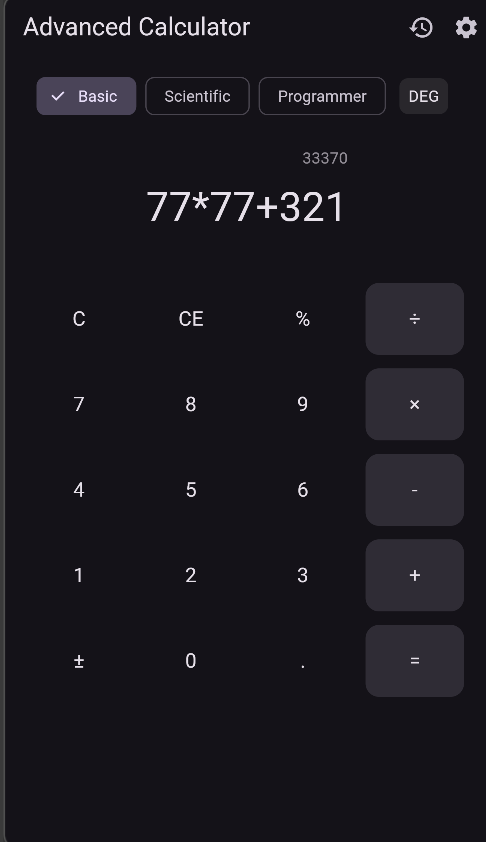
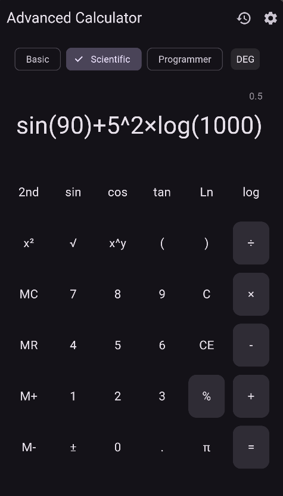
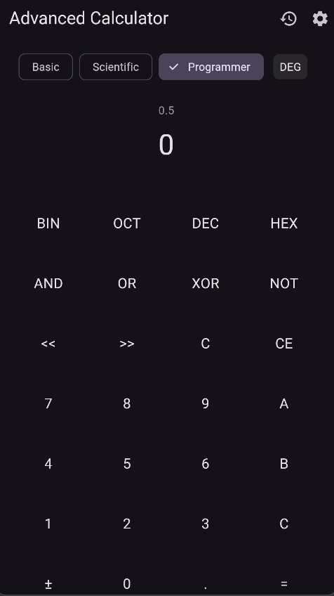

Máy Tính Nâng Cao — Flutter

Một ứng dụng máy tính nâng cao được xây dựng bằng Flutter, hỗ trợ Chế độ Cơ bản, Chế độ Khoa học và Chế độ Lập trình với giao diện hiện đại, quản lý trạng thái bằng Provider và khả năng xử lý biểu thức toán học mạnh mẽ.

1. Mô tả Dự án

Máy Tính Nâng Cao là ứng dụng đa chức năng gồm:

Bộ xử lý biểu thức mạnh (PEMDAS, ngoặc, nhân ngầm)

Các chế độ: Cơ bản / Khoa học / Lập trình

Lưu lịch sử tính toán (50 mục)

Chủ đề: Sáng / Tối / Theo hệ thống

Các thao tác gesture: vuốt, nhấn giữ, phóng to thu nhỏ

Giao diện đẹp, hiệu ứng mượt

Ứng dụng được thiết kế để mô phỏng các máy tính chuyên nghiệp trên Android/iOS.

2. Tính năng

Chế độ Cơ bản

Phép tính cơ bản: + − × ÷

C, CE (Xóa), %, ±

Hiển thị nhiều dòng

Lịch sử 3 phép tính gần nhất

Chế độ Khoa học

sin, cos, tan, asin, acos, atan

log, ln, log₂

x², x³, xʸ

√, ∛

π, e

Ngoặc ()

n! (Giai thừa)

Chế độ góc: Độ / Radian

Bộ nhớ: M+, M−, MR, MC

Chế độ Lập trình

Nhị phân / Bát phân / Thập phân / Thập lục phân

AND, OR, XOR, NOT

Dịch trái << và dịch phải >>

Chuyển đổi hệ theo thời gian thực

Lịch sử

Lưu 25–100 phép tính (tùy chỉnh)

Nhấn vào lịch sử để dùng lại

Vuốt để xóa

Nhấn giữ “C” để xóa toàn bộ lịch sử

Giao diện và Trải nghiệm

Hiển thị nhiều dòng

Hiệu ứng nút nhấn

Hiệu ứng chuyển chế độ

Hiệu ứng rung khi lỗi

Phóng to thu nhỏ để thay đổi cỡ chữ

Vuốt để xóa ký tự cuối

Cài đặt

Chủ đề: Sáng / Tối / Theo hệ thống

Độ chính xác thập phân: 2–10

Chế độ góc: Độ / Radian

Phản hồi rung

Hiệu ứng âm thanh

Kích thước lịch sử

Xóa toàn bộ lịch sử

3. Hình ảnh minh họa

Chế độ Cơ bản Chế độ Khoa học Chế độ Lập trình Cài đặt Lịch sử

4. Sơ đồ Kiến trúc

Thư mục chính

lib/
│
├── main.dart
│
├── models/
│   ├── calculation_history.dart
│   ├── calculator_mode.dart
│   └── calculator_settings.dart
│
├── providers/
│   ├── calculator_provider.dart
│   ├── theme_provider.dart
│   └── history_provider.dart
│
├── screens/
│   ├── calculator_screen.dart
│   ├── history_screen.dart
│   └── settings_screen.dart
│
├── widgets/
│   ├── display_area.dart
│   ├── button_grid.dart
│   └── calculator_button.dart
│
├── utils/
│   ├── calculator_logic.dart
│   ├── expression_parser.dart
│   └── constants.dart
│
└── services/
    └── storage_service.dart

Mô hình hoạt động

Giao diện (Screens + Widgets)
        ↓
Provider (Quản lý trạng thái)
        ↓
Logic + Parser + Lưu trữ
        ↓
Models (Dữ liệu)

5. Hướng dẫn Cài đặt

Tải dự án

git clone https://github.com/lonely-ntc/flutter_advanced_calculator_NguyenTheChuong.git
cd flutter_advanced_calculator_NguyenTheChuong

Cài đặt gói

flutter pub get

Chạy ứng dụng

flutter run

6. Hướng dẫn Kiểm thử

Chạy toàn bộ kiểm thử:

flutter test

Các kiểm thử quan trọng:

Phân tích biểu thức

Hàm lượng giác

Phép toán bitwise trong chế độ lập trình

Chức năng bộ nhớ

Lưu và tải chủ đề sáng/tối

Lưu và tải lịch sử

Tương tác nút và gesture

Kiểm thử tích hợp:

flutter test integration_test

7. Hạn chế Hiện tại

Nhân ngầm chưa hỗ trợ tất cả mẫu phức tạp

Giai thừa hạn chế với số lớn

Chế độ lập trình chưa hỗ trợ chuyển đổi bù 2 có dấu

Giao diện chưa tối ưu hoàn toàn cho máy tính bảng

8. Cải tiến Tương lai

Vẽ đồ thị f(x)

Nhập liệu bằng giọng nói

Xuất lịch sử ra CSV / PDF

Chủ đề tùy chỉnh nhiều màu

Hỗ trợ nhập bằng bàn phím vật lý

Cải thiện bộ phân tích biểu thức để xử lý nhân ngầm nâng cao