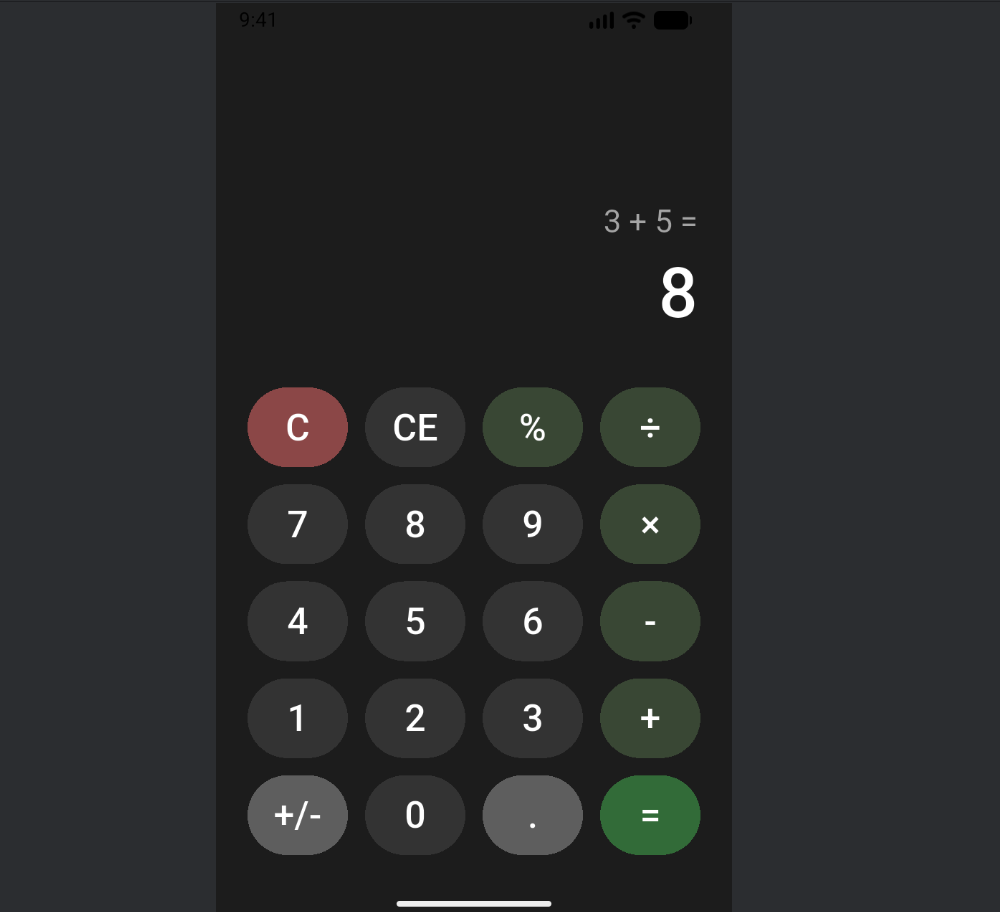
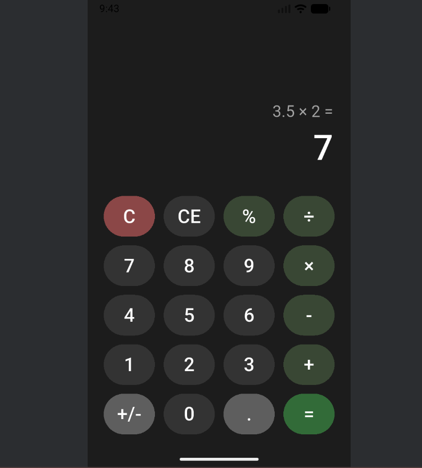
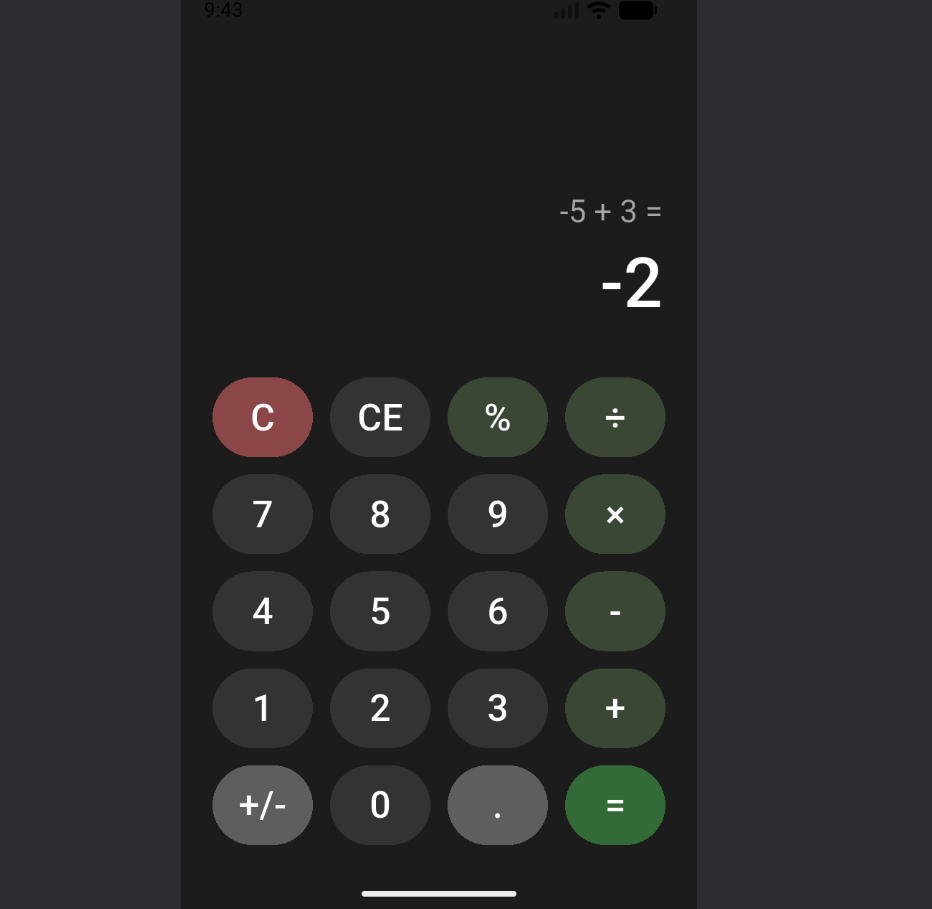
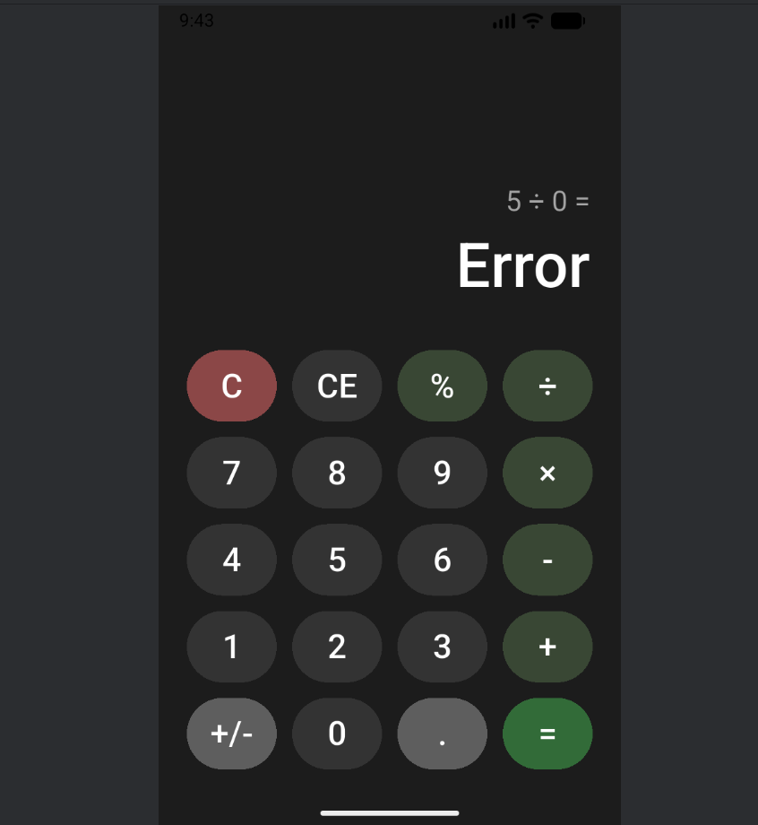
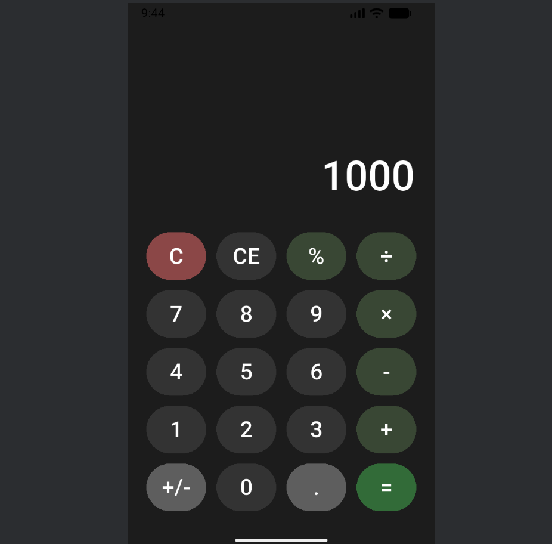
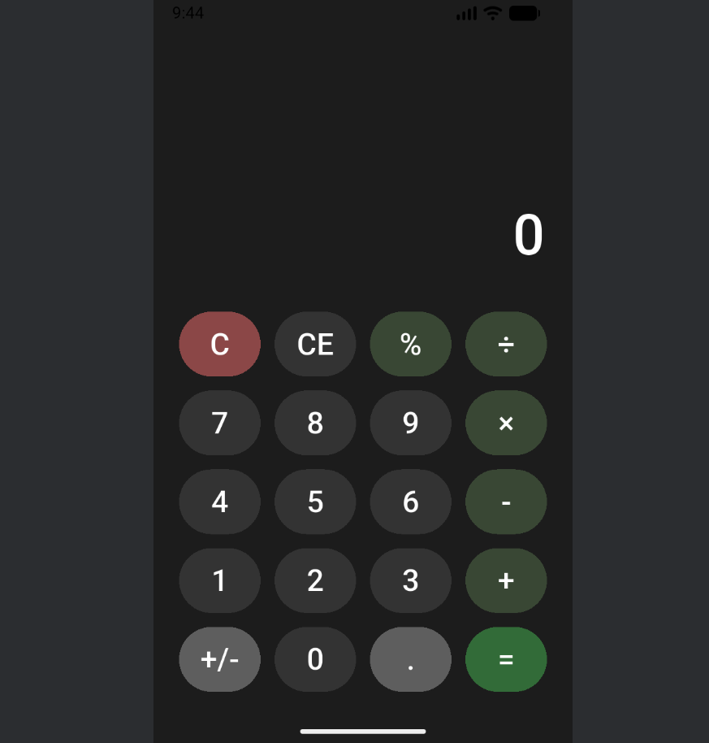
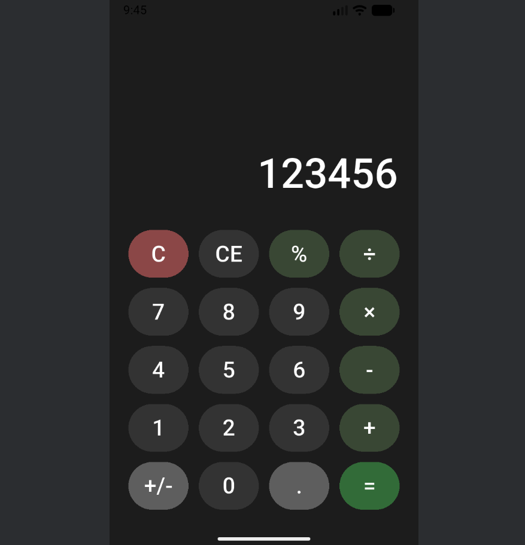
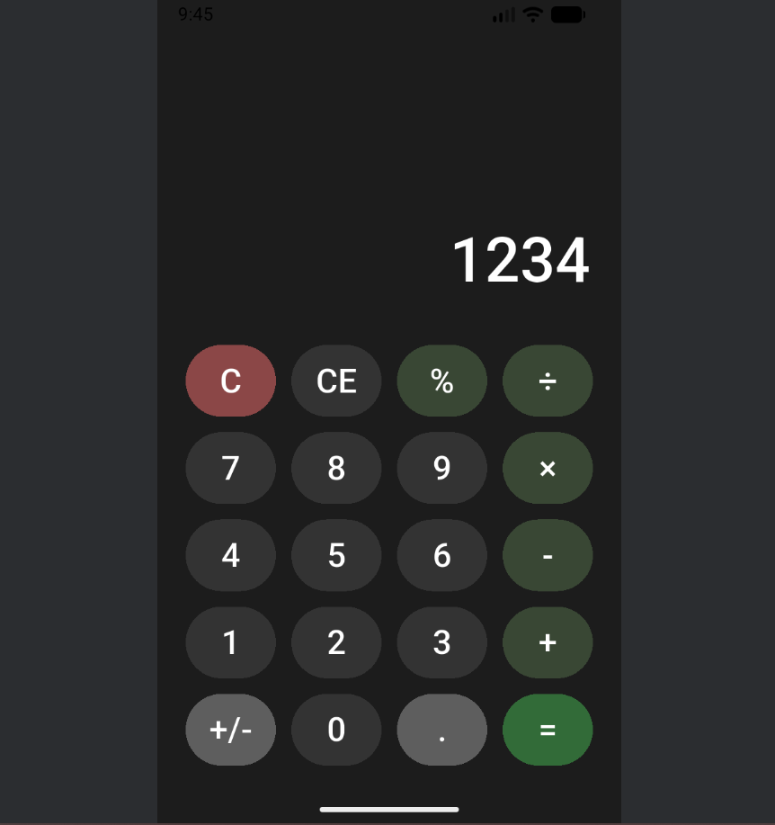
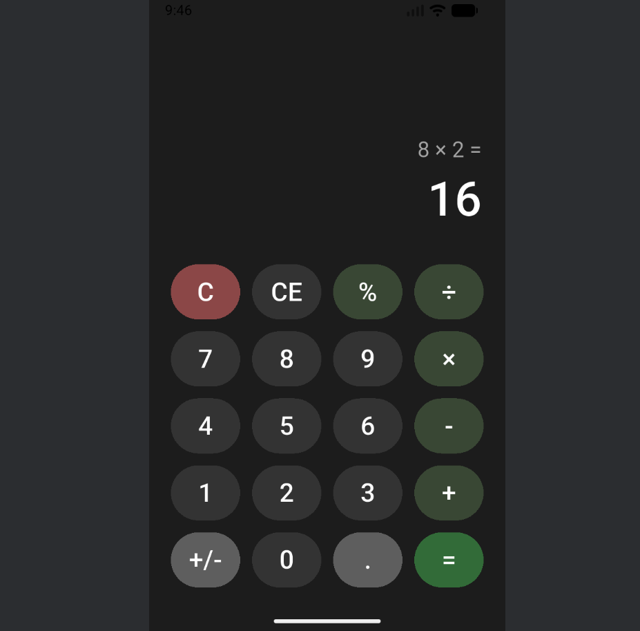

# 📱 Flutter Calculator App

## 📌 Project Description
This is a simple and fully functional Calculator application built using Flutter.  
The app performs basic arithmetic operations with a clean and responsive UI inspired by modern design principles.

---

## 🚀 Features

- Basic arithmetic operations: Addition, Subtraction, Multiplication, Division
- Responsive button layout (based on Figma design)
- Clear (C) and Backspace (⌫) functionality
- Decimal number support
- Error handling (e.g., division by zero)
- Instant result feedback
- Smooth and user-friendly experience

---

## 🧠 Learning Outcomes

Upon successful completion, this project demonstrates:

- A fully functional calculator application
- UI/UX implementation from Figma design to Flutter code
- State management in interactive applications
- Problem-solving skills (handling edge cases & input validation)
- Clean code structure and separation of concerns

---

## 🖼️ Screenshots

1. Basic operations: 5 + 3 = 8 

1. Decimal operations: 3.5 × 2 = 7 

2. Negative numbers: -5 + 3 = -2 

3. Division by zero handling 

4. Clear functionality 

5. CE functionality 

6. Chain operations: 5 + 3 × 2 = 16
