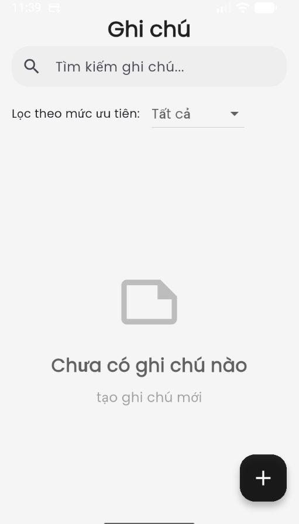
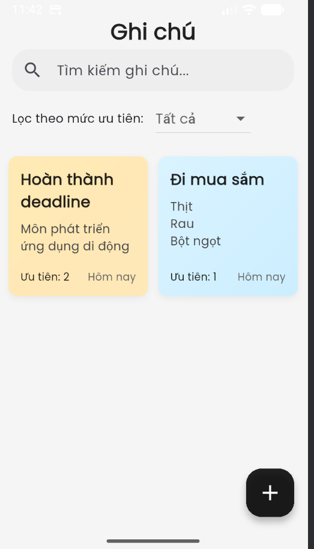
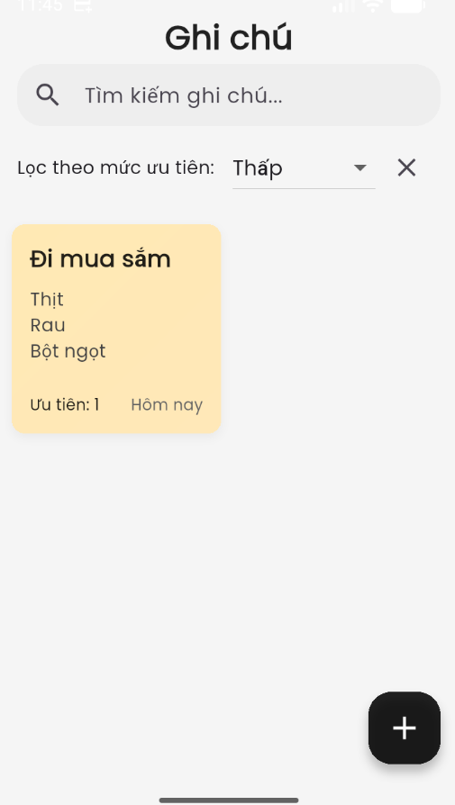
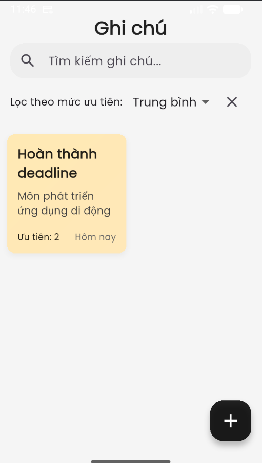
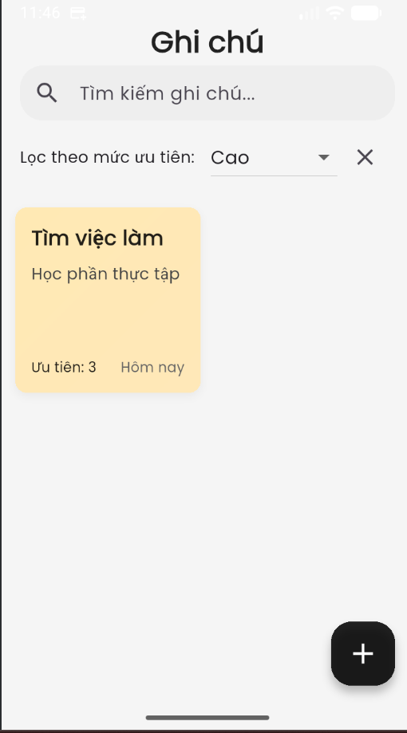
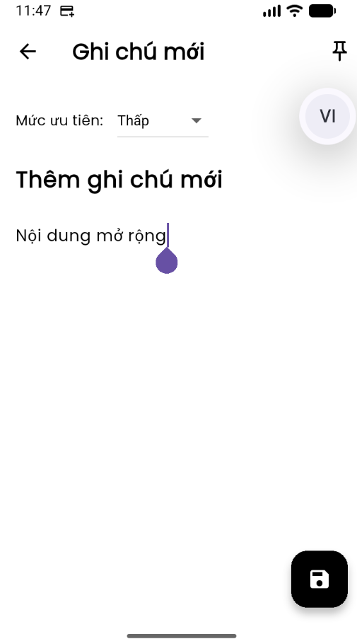
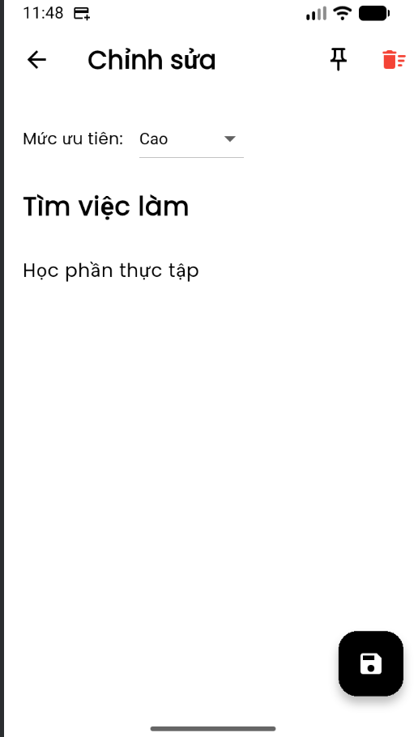
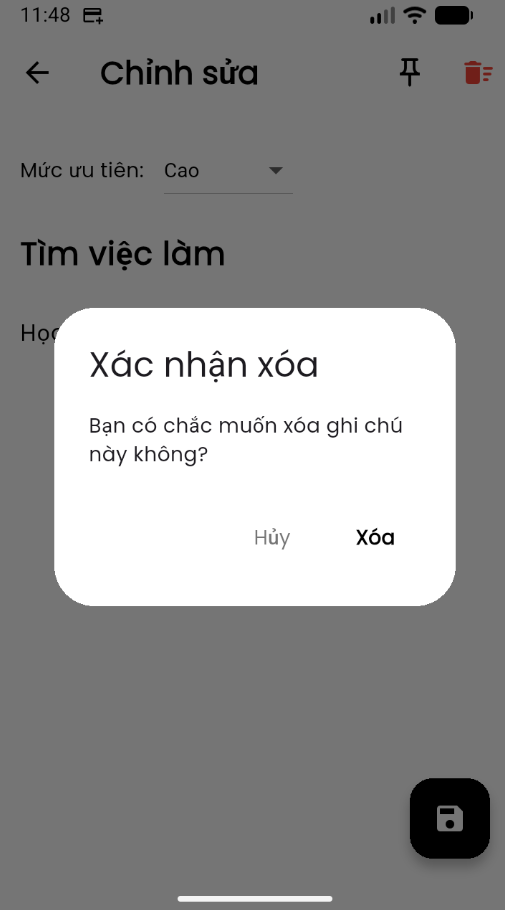

# Simple Note App – Flutter  
Ứng dụng ghi chú đơn giản, hiện đại và hoạt động hoàn toàn offline.

**Simple Note App** là một ứng dụng ghi chú được phát triển bằng **Flutter**, sử dụng **SQLite** để lưu trữ dữ liệu cục bộ và **Provider** để quản lý trạng thái một cách nhẹ nhàng và hiệu quả. Ứng dụng được thiết kế với tiêu chí **tối giản – nhanh – mượt**, phù hợp cho người dùng cần ghi chú nhanh, theo dõi thông tin cá nhân hoặc quản lý công việc hằng ngày.
=

## Công Nghệ Sử Dụng

### Framework & Platform
- **Flutter 3.x** – Framework đa nền tảng để xây dựng UI và logic ứng dụng  
- **Dart** – Ngôn ngữ lập trình chính  
- **Material Design** – Bộ UI mặc định cho giao diện hiện đại  

### Local Database
- **Sqflite** – SQLite database để lưu trữ ghi chú hoàn toàn offline  
- **Path Provider** – Lấy đường dẫn thư mục lưu trữ database  
- **Intl** – Định dạng thời gian (datetime format)  

### State Management
- **Provider** – Quản lý trạng thái, giúp UI cập nhật real-time  

### UI/UX & Utilities
- **Custom Widgets** – Build các widget tái sử dụng như Note Card  
- **Color Utilities** – Hệ thống màu chung cho toàn app  
- **Responsive Layout** – Tối ưu hiển thị trên mọi kích thước màn hình  

## Tính Năng Chính

### Quản Lý Ghi Chú
- Tạo ghi chú mới  
- Chỉnh sửa ghi chú  
- Xoá ghi chú (có hộp thoại xác nhận)  
- Ghim ghi chú quan trọng (Pin Note)  
- Gán mức độ ưu tiên (Priority Levels)  

### Tìm Kiếm & Lọc
- Tìm kiếm ghi chú theo tiêu đề và nội dung  
- Lọc nhanh ghi chú được ghim  
- Hiển thị kết quả theo thời gian thực (real-time)  

### Trình Bày & Sắp Xếp
- Sắp xếp theo thời gian cập nhật mới nhất  
- Hiển thị giao diện trực quan, tối giản  
- Màu sắc phân loại rõ ràng theo priority  
- Danh sách ghi chú với preview nội dung  

### Lưu Trữ & Đồng Bộ
- Lưu trữ **100% offline** bằng SQLite  
- Không yêu cầu Internet để hoạt động  
- Khởi tạo database tự động khi cài app  

### Trải Nghiệm Người Dùng
- Tốc độ load nhanh, thao tác mượt mà  
- UI hiện đại – tối giản – dễ sử dụng  
- Animation nhẹ nhàng và tự nhiên  
- Tối ưu tốt trên nhiều kích thước màn hình  

## Ảnh Minh Hoạ
# Giao dien chinh 

# Them note

# Bo loc

# Them ghi chu moi

# Chinh sua ghi chu

